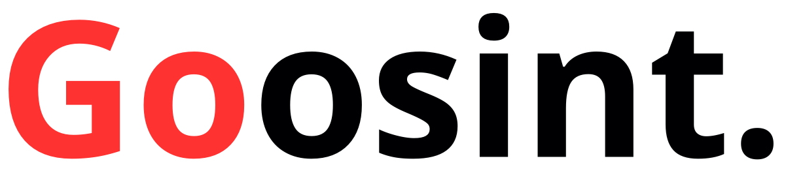

 IDEES
S'inspirer de https://github.com/sindresorhus/awesome?tab=readme-ov-file pour rediger la racine a partir de ces donnees de https://goosint.com/about
Mettre logo de goosint avec lien du reot original  source https://docs.github.com/fr/get-started/writing-on-github/getting-started-with-writing-and-formatting-on-github/basic-writing-and-formatting-syntax#images
Liste emoji à mettre dans about https://github.com/ikatyang/emoji-cheat-sheet/blob/master/README.md

## [↑](#table-of-contents) Goosint Repositories
_Amazing lists about all kinds of cybersecurity topics :space_invader:_ 
- [Goosint Cyber Toolkit](https://github.com/khalil-b1/goosint-cyber-toolkit) - A curated list of free Cyber & Threat intelligence web-based tools for cybersecurity professionnals.
- 

## Table of Contents
- [Titre section](#section)
donner les titres à chatgpt pour les tronsfrmer en format URI RFC 3986 [Titre](#format URI RF 3986 du titre)

## [↑](#table-of-contents) Credits
Goosint is a personal project that started out in May 2023 as initially for sharing amazing, free, and ready-to-use [Open-source intelligence (OSINT)](https://en.wikipedia.org/wiki/Open-source_intelligence) tools for cybersecurity specialists.
At the end of 2023, the plateform has expanded to cover other topics in the field of peoples’ safety in France, and Information Security in general.
In February 2025, I decided to migrate my website, goosint.com, with +300 resources curated for almost 2 years to github.com and make it more collaborative.

## [↑](#table-of-contents) Contributing
Soon

## [↑](#table-of-contents) Section
_Objet section_ 
- [Outil](https) - description.

## [↑](#table-of-contents) Section
_Objet section_ 
- [Outil](https) - description.

## [↑](#table-of-contents) Section
_Objet section_ 
- [Outil](https) - description.

## [↑](#table-of-contents) Section
_Objet section_ 
- [Outil](https) - description.

## [↑](#table-of-contents) License
This work is licensed under [CC BY-NC-SA 4.0](https://creativecommons.org/licenses/by-nc-sa/4.0/?ref=chooser-v1). In other words, share generously but provide attribution to the authors.

Sincerely, [Khalil B.](https://www.linkedin.com/in/khalilb/)
